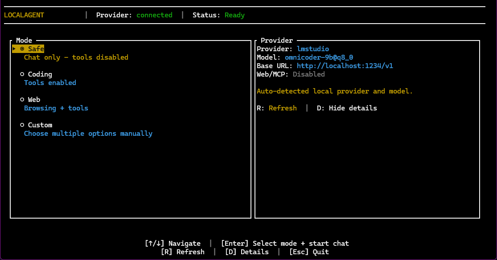

# LocalAgent

> Local-first agent runtime for MCP workflows with explicit trust controls and replayable runs.

LocalAgent helps you get from curiosity to a working local agent workflow without fighting provider setup, unsafe defaults, or opaque failures.

It is built for the hard part of local agents: connecting on-machine LLMs to MCP tools in a way that is guided, inspectable, and operationally clear.



## Why LocalAgent

Most friction in local agents is operational.

LocalAgent narrows that gap with:

* guided startup and provider auto-detection
* interactive TUI chat for local agent workflows
* explicit trust controls with approvals and audit trails
* replayable artifacts and inspectable event logs
* safe defaults with shell and write access disabled unless explicitly enabled
* built-in eval workflows and reviewable run outputs
* a beginner-friendly path without hiding advanced controls

## Quick start

Start a supported local provider, then launch LocalAgent in the project directory you want to work in.

```bash
# 1) Install from the repo root
cargo install --path . --force

# 2) Launch LocalAgent in the workspace you want to work in
localagent
```

If your provider starts after LocalAgent is already open, press `R` in the startup screen to refresh provider detection.

### Supported providers

* Ollama
* LM Studio
* llama.cpp server

## Common commands

### One-shot task

```bash
localagent --provider ollama --model llama3.2 --prompt "Summarize src/main.rs" run
```

### Interactive TUI chat

```bash
localagent --provider ollama --model llama3.2 chat --tui
```

### Verify a provider

```bash
localagent doctor --provider ollama
localagent doctor --provider lmstudio
localagent doctor --provider llamacpp
```

### Enable trust controls

```bash
localagent --trust on --provider ollama --model llama3.2 chat --tui
```

Enable shell and write tools only when you intentionally want side effects.

### CLI note

Global flags come before subcommands. See the examples above and the [CLI reference](docs/reference/CLI_REFERENCE.md) for full command syntax.

## Safety model

LocalAgent is designed to make side effects explicit.

* shell and write access are disabled unless explicitly enabled
* `--allow-shell-in-workdir` is a narrower shell mode than `--allow-shell`
* trust mode can enforce policy and approvals
* persistent runs remain inspectable through artifacts and logs

The goal is not to remove every restriction. It is to make local agents usable without hiding risk.

## Provider setup

Before running LocalAgent, start a supported local provider and make sure a model is available.

See: [Provider setup](docs/guides/LLM_SETUP.md)

## Installation

### Build from source

```bash
cargo build --release
```

Binary output:

* Windows: `target/release/localagent.exe`
* Linux/macOS: `target/release/localagent`

### Install globally from source

```bash
cargo install --path . --force
```

### Releases

Prebuilt binaries are available in GitHub Releases.

For full install, updates, Windows troubleshooting, and verification steps, see:

* [Install guide](docs/guides/INSTALL.md)

## Docs

### Getting started

* [Install guide](docs/guides/INSTALL.md)
* [Provider setup](docs/guides/LLM_SETUP.md)
* [Repo entry guide](AGENTS.md)

### Runtime internals

* [Runtime architecture](docs/architecture/RUNTIME_ARCHITECTURE.md)
* [Operational runbook](docs/operations/OPERATIONAL_RUNBOOK.md)
* [Configuration and state](docs/reference/CONFIGURATION_AND_STATE.md)
* [CLI reference](docs/reference/CLI_REFERENCE.md)

### Runtime policy

* [Runtime loop policy](docs/policy/AGENT_RUNTIME_PRINCIPLES_2026.md)
* [Runtime change review template](docs/policy/AGENT_RUNTIME_CHANGE_REVIEW_TEMPLATE.md)

### Additional docs

* [Templates](docs/guides/TEMPLATES.md)
* [Release notes](docs/release-notes/README.md)
* [Changelog](CHANGELOG.md)

## Contributing

Issues, feedback, and contributions are welcome.

Start here:

* [Contributing guide](CONTRIBUTING.md)

## License

MIT
